# 📚 TÀI LIỆU TOÀN BỘ PHẦN STAFF - Dự án Web Đặt Bàn Nhà Hàng

> [!IMPORTANT]
> Tài liệu này tổng hợp **toàn bộ kiến thức** về phần Staff mà bạn đảm nhận, bao gồm kiến trúc, luồng xử lý, database, bảo mật, và các câu hỏi vấn đáp thường gặp.

---

## 1. TỔNG QUAN DỰ ÁN

### 1.1 Công nghệ sử dụng

| Thành phần | Công nghệ | Phiên bản |
|---|---|---|
| Backend Framework | Spring Boot | 4.0.6 |
| Java | JDK | 17 |
| Template Engine | Thymeleaf | (đi kèm Spring Boot) |
| ORM | Spring Data JPA / Hibernate | (đi kèm Spring Boot) |
| Database | MySQL | - |
| Bảo mật | Spring Security | (đi kèm Spring Boot) |
| Build Tool | Maven | - |
| Thư viện phụ trợ | Lombok, Apache POI, OpenPDF | - |

### 1.2 Kiến trúc phân tầng (Layered Architecture)

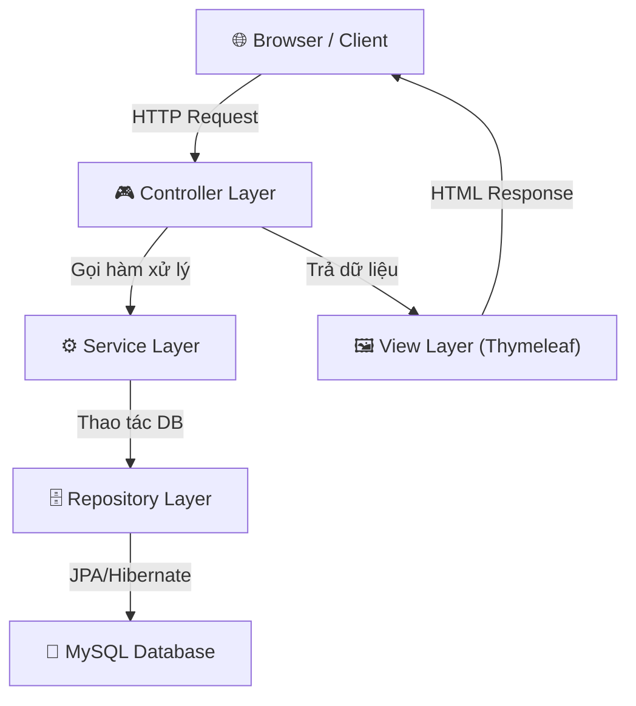

**Giải thích từng tầng:**

| Tầng | Vai trò | Package |
|---|---|---|
| **Controller** | Nhận request HTTP, điều hướng, gọi Service, trả View | `controller.staff.*` |
| **Service** | Xử lý logic nghiệp vụ, validation, transaction | `service.*` + `service.impl.*` |
| **Repository** | Truy vấn database thông qua JPA | `repository.*` |
| **Entity** | Ánh xạ bảng trong DB thành Java Object | `entity.*` |
| **DTO** | Đối tượng truyền dữ liệu (Data Transfer Object) | `dto.*` |
| **Security** | Xác thực, phân quyền | `security.*` |
| **View** | Giao diện HTML dùng Thymeleaf | `templates/staff/*` |

### 1.3 Cấu trúc thư mục phần Staff

```
src/main/java/vn/edu/ptit/restaurant/
├── controller/staff/
│   ├── StaffDashboardController.java     ← Trang tổng quan
│   ├── StaffOrderController.java         ← Quản lý đơn hàng (gọi món, thanh toán)
│   ├── StaffReservationController.java   ← Quản lý đặt bàn
│   ├── StaffTableController.java         ← Quản lý trạng thái bàn
│   ├── StaffInvoiceController.java       ← Xem hóa đơn đã thanh toán
│   └── StaffProfileController.java       ← Thông tin cá nhân Staff
│
├── service/
│   ├── OrderService.java (interface)
│   ├── ReservationService.java (interface)
│   ├── PaymentService.java (interface)
│   ├── DiningTableService.java (interface)
│   ├── OrderItemService.java (interface)
│   ├── UserService.java (interface)
│   └── impl/
│       ├── OrderServiceImpl.java         ← Logic tạo/hủy/đóng order
│       ├── ReservationServiceImpl.java   ← Logic xác nhận/check-in đặt bàn
│       ├── PaymentServiceImpl.java       ← Logic thanh toán
│       ├── OrderItemServiceImpl.java     ← Logic thêm/xóa món
│       └── UserServiceImpl.java          ← Logic cập nhật profile, đổi MK
│
├── entity/
│   ├── Order.java, Reservation.java, Payment.java
│   ├── DiningTable.java, MenuItem.java, OrderItem.java
│   ├── User.java, Area.java, Category.java
│   └── enums/ (OrderStatus, ReservationStatus, TableStatus, ...)
│
├── repository/
│   ├── OrderRepository.java, ReservationRepository.java
│   ├── PaymentRepository.java, DiningTableRepository.java, ...
│
└── security/
    ├── SecurityConfig.java
    ├── CustomUserDetailsService.java
    └── CustomAuthenticationSuccessHandler.java

src/main/resources/templates/staff/
├── dashboard/index.html
├── order/index.html, detail.html
├── reservation/index.html
├── table/index.html
├── invoice/index.html, detail.html
└── profile/index.html
```

---

## 2. HỆ THỐNG PHÂN QUYỀN & BẢO MẬT

### 2.1 Vai trò (Role)

Hệ thống có 3 vai trò: `CUSTOMER`, `STAFF`, `ADMIN`

```java
public enum Role {
    CUSTOMER, STAFF, ADMIN
}
```

### 2.2 Cấu hình Spring Security

Trong [SecurityConfig.java](file:///Volumes/study/laptrinhweb/web_dat_ban/src/main/java/vn/edu/ptit/restaurant/security/SecurityConfig.java):

```java
.requestMatchers("/staff/**").hasAnyRole("ADMIN", "STAFF")
```

> [!NOTE]
> **Ý nghĩa:** Tất cả URL bắt đầu bằng `/staff/` chỉ cho phép user có role `STAFF` hoặc `ADMIN` truy cập. Customer không vào được.

### 2.3 Luồng đăng nhập của Staff

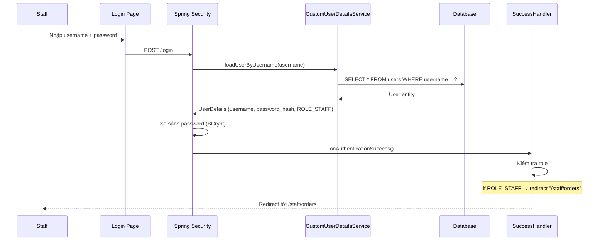

**Chi tiết `CustomUserDetailsService`:** Chuyển đổi `User` entity thành `UserDetails` của Spring Security:
```java
return new User(
    user.getUsername(),
    user.getPassword(),
    Collections.singletonList(new SimpleGrantedAuthority("ROLE_" + user.getRole().name()))
);
```
> Role `STAFF` sẽ thành `ROLE_STAFF` → match với `hasAnyRole("STAFF")` trong SecurityConfig.

**`CustomAuthenticationSuccessHandler`** điều hướng sau đăng nhập:
- `ROLE_ADMIN` → `/admin/reports`
- `ROLE_STAFF` → `/staff/orders`
- Còn lại (CUSTOMER) → `/`

### 2.4 Mã hóa mật khẩu

- Sử dụng **BCryptPasswordEncoder** (một chiều, không giải mã được)
- Khi đăng ký/đổi mật khẩu: `passwordEncoder.encode(rawPassword)` → hash
- Khi đăng nhập: `passwordEncoder.matches(rawPassword, hash)` → true/false

---

## 3. CƠ SỞ DỮ LIỆU (DATABASE)

### 3.1 Sơ đồ ERD (Entity Relationship Diagram)

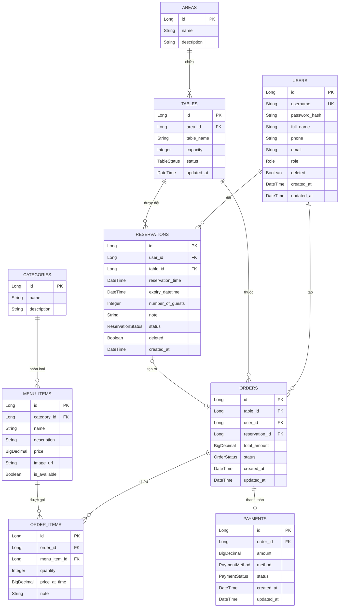

### 3.2 Các Enum trạng thái quan trọng

| Enum | Giá trị | Ý nghĩa |
|---|---|---|
| **OrderStatus** | `PENDING` | Mới tạo, chờ phục vụ |
| | `CONFIRMED` | Đã xác nhận |
| | `SERVING` | Đang phục vụ |
| | `COMPLETED` | Đã thanh toán xong, đã đóng bàn |
| | `CANCELLED` | Đã hủy |
| **ReservationStatus** | `PENDING` | Chờ xác nhận |
| | `CONFIRMED` | Đã xác nhận |
| | `CANCELLED` | Đã hủy |
| | `COMPLETED` | Khách đã đến (Check-in xong) |
| **TableStatus** | `AVAILABLE` | Bàn trống |
| | `OCCUPIED` | Đang có khách |
| | `RESERVED` | Đã được đặt trước |
| | `MAINTENANCE` | Bảo trì |
| **PaymentMethod** | `CASH`, `CARD`, `E_WALLET`, `BANK_TRANSFER` | Phương thức thanh toán |
| **PaymentStatus** | `PENDING`, `PAID`, `FAILED`, `REFUNDED` | Trạng thái thanh toán |

---

## 4. CÁC MODULE CHỨC NĂNG CỦA STAFF

---

### 4.1 📊 MODULE DASHBOARD (Trang tổng quan)

**Controller:** [StaffDashboardController.java](file:///Volumes/study/laptrinhweb/web_dat_ban/src/main/java/vn/edu/ptit/restaurant/controller/staff/StaffDashboardController.java)
**URL:** `GET /staff/dashboard`
**Template:** `staff/dashboard/index.html`

**Dữ liệu hiển thị:**

| Thông tin | Cách tính | Service |
|---|---|---|
| Số đặt bàn hôm nay | Lọc reservation có `reservationTime` = today & status = PENDING/CONFIRMED | `ReservationService.findAll()` |
| Đặt bàn chờ xử lý | Lọc reservation status = PENDING | `ReservationService.findAll()` |
| Số order đang phục vụ | Lọc order status = PENDING/SERVING | `OrderService.findAll()` |
| Doanh thu hôm nay | Tổng `amount` của Payment status = PAID & `createdAt` = today | `PaymentService.findAll()` |
| Bàn trống / Bàn đang phục vụ | Đếm bàn theo status | `DiningTableService.findByStatus()` |
| Đặt bàn sắp tới | 5 reservation gần nhất trong ngày, status PENDING/CONFIRMED | `ReservationService.findUpcoming(5)` |
| Danh sách order đang phục vụ | Order status = PENDING/SERVING | `OrderService.findAll()` |

**Luồng xử lý:**
```
GET /staff/dashboard
    → StaffDashboardController.dashboard()
        → Gọi 4 service: ReservationService, OrderService, PaymentService, DiningTableService
        → Tính toán thống kê bằng Java Stream API (filter, count, map, reduce)
        → Đưa dữ liệu vào Model
        → Return "staff/dashboard/index" (Thymeleaf render HTML)
```

---

### 4.2 🍽️ MODULE ORDER (Quản lý đơn hàng - QUAN TRỌNG NHẤT)

**Controller:** [StaffOrderController.java](file:///Volumes/study/laptrinhweb/web_dat_ban/src/main/java/vn/edu/ptit/restaurant/controller/staff/StaffOrderController.java)
**Base URL:** `/staff/orders`

#### 4.2.1 Danh sách đơn hàng

| API | Method | Mô tả |
|---|---|---|
| `/staff/orders` | GET | Xem tất cả order + bàn + map bàn→order |

**Logic:** Tạo `Map<Long, Order> activeOrderByTable` để biết bàn nào đang có order active (PENDING/SERVING).

#### 4.2.2 Tạo đơn hàng mới (Mở bàn)

| API | Method | Mô tả |
|---|---|---|
| `/staff/orders/create` | POST | Tạo order mới cho 1 bàn |

**Params:** `tableId` (ID bàn)

**Luồng chi tiết:**

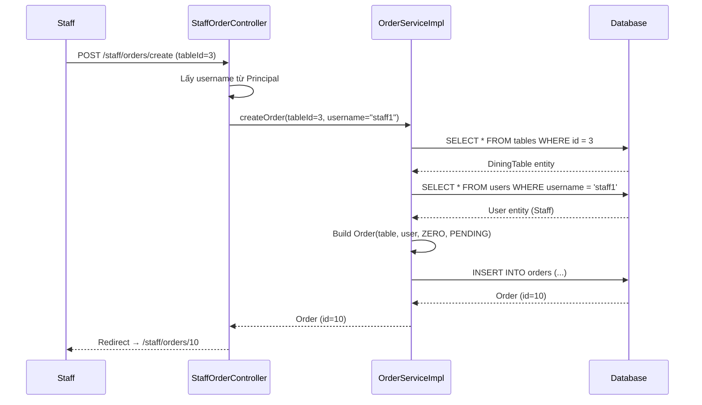

> [!NOTE]
> Khi mới tạo order, **bàn CHƯA chuyển sang OCCUPIED**. Bàn chỉ chuyển sang OCCUPIED khi staff nhấn "Bắt đầu phục vụ" (chuyển order sang SERVING).

#### 4.2.3 Xem chi tiết & Gọi món

| API | Method | Mô tả |
|---|---|---|
| `/staff/orders/{id}` | GET | Xem chi tiết order, danh sách món đã gọi, menu |
| `/staff/orders/{id}/add-item` | POST | Thêm món vào order |
| `/staff/orders/{id}/delete-item/{itemId}` | GET | Xóa món khỏi order |

**Thêm món - Luồng chi tiết (`OrderItemServiceImpl.addMenuItemToOrder`):**

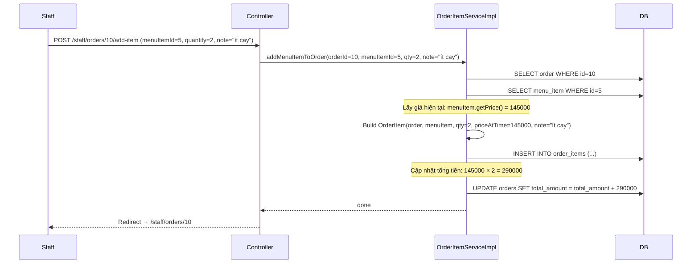

> [!IMPORTANT]
> `priceAtTime` lưu giá **tại thời điểm gọi món**, không phải giá hiện tại. Nếu Admin thay đổi giá sau đó, giá trong order không bị ảnh hưởng. Đây là best practice trong hệ thống thương mại.

**Xóa món - Luồng chi tiết (`OrderItemServiceImpl.deleteOrderItem`):**
1. Tìm OrderItem theo ID
2. Trừ tổng tiền: `totalAmount -= priceAtTime × quantity`
3. Xóa OrderItem khỏi DB
4. Cập nhật lại Order

#### 4.2.4 Cập nhật trạng thái đơn hàng

| API | Method | Mô tả |
|---|---|---|
| `/staff/orders/{id}/update-status` | POST | Chuyển trạng thái (PENDING → SERVING) |

**Luồng trạng thái Order:**

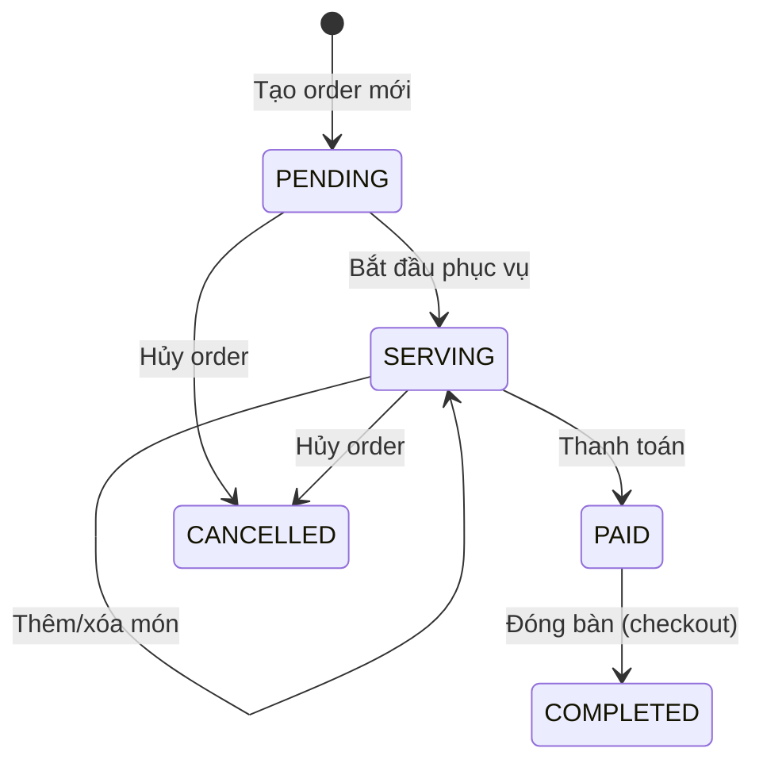

> [!IMPORTANT]
> Khi chuyển sang `SERVING`, hệ thống **tự động chuyển bàn sang `OCCUPIED`**:
> ```java
> if (newStatus == OrderStatus.SERVING && order.getTable() != null) {
>     DiningTable table = order.getTable();
>     table.setStatus(TableStatus.OCCUPIED);
>     diningTableRepository.save(table);
> }
> ```

#### 4.2.5 Thanh toán

| API | Method | Mô tả |
|---|---|---|
| `/staff/orders/{id}/pay` | POST | Tạo Payment cho order |

**Params:** `paymentMethod` (CASH / CARD / E_WALLET / BANK_TRANSFER)

**Luồng chi tiết (`PaymentServiceImpl.createPayment`):**

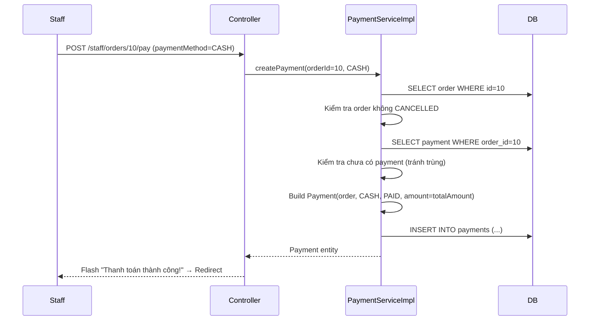

> [!NOTE]
> **Validation quan trọng:**
> - Không cho thanh toán order đã CANCELLED
> - Không cho thanh toán 2 lần (kiểm tra `findByOrderId`)
> - Trạng thái Payment luôn tạo là `PAID` (đã thanh toán xong luôn)

#### 4.2.6 Đóng bàn (Checkout)

| API | Method | Mô tả |
|---|---|---|
| `/staff/orders/{id}/close-table` | POST | Đóng bàn, giải phóng bàn |

**Luồng chi tiết (`OrderServiceImpl.checkout`):**

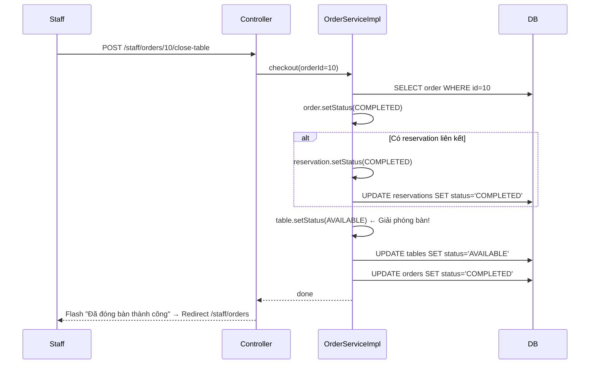

#### 4.2.7 Hủy đơn hàng

| API | Method | Mô tả |
|---|---|---|
| `/staff/orders/{id}/cancel` | POST | Hủy order, giải phóng bàn |

**Luồng (`OrderServiceImpl.cancelOrder`):**
1. Order → `CANCELLED`
2. Bàn → `AVAILABLE` (giải phóng)
3. Nếu có Reservation liên kết → Reservation cũng → `CANCELLED`

---

## 4.3 📅 MODULE RESERVATION (Quản lý đặt bàn)

**Controller:** [StaffReservationController.java](file:///Volumes/study/laptrinhweb/web_dat_ban/src/main/java/vn/edu/ptit/restaurant/controller/staff/StaffReservationController.java)
**Base URL:** `/staff/reservations`

| API | Method | Mô tả |
|---|---|---|
| `/staff/reservations` | GET | Xem danh sách đặt bàn (có lọc theo status) |
| `/staff/reservations/{id}/confirm` | POST | Xác nhận đặt bàn |
| `/staff/reservations/{id}/cancel` | POST | Hủy đặt bàn |
| `/staff/reservations/{id}/checkin` | POST | Check-in khách (quan trọng!) |

#### 4.3.1 Xác nhận đặt bàn (Confirm)

**Luồng (`ReservationServiceImpl.confirmReservation`):**
```
PENDING → CONFIRMED
```
- Chỉ confirm được khi status = PENDING
- Bàn vẫn giữ trạng thái RESERVED (không đổi)

#### 4.3.2 Hủy đặt bàn (Cancel)

**Luồng (`ReservationServiceImpl.adminCancelReservation`):**
```
Reservation → CANCELLED
Bàn → AVAILABLE (trả bàn)
Order (nếu có) → CANCELLED
```

#### 4.3.3 ⭐ Check-in (Khách đến nhà hàng)

Đây là luồng **quan trọng nhất** của Reservation, kết nối sang module Order:

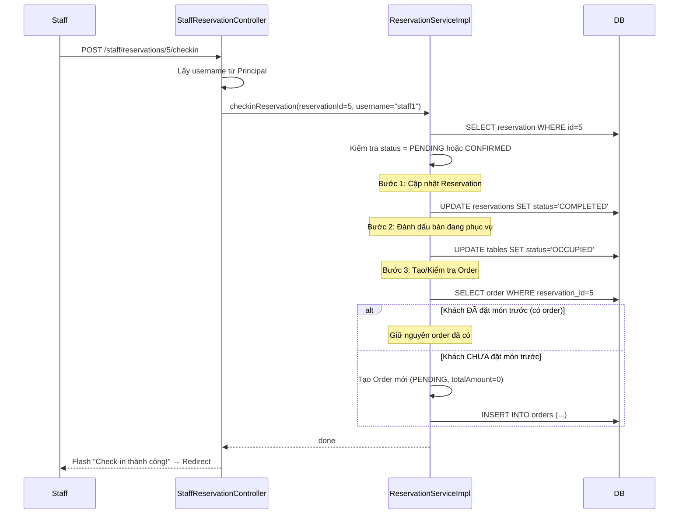

> [!IMPORTANT]
> **Check-in thực hiện 3 việc cùng lúc (trong 1 transaction):**
> 1. Reservation → `COMPLETED`
> 2. Bàn → `OCCUPIED`
> 3. Tạo Order mới (nếu khách chưa đặt món trước) hoặc giữ nguyên Order có sẵn (nếu khách đã đặt món khi đặt bàn)

#### 4.3.4 Luồng trạng thái Reservation tổng hợp

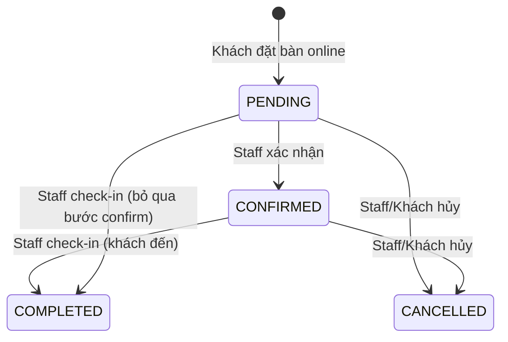

---

## 4.4 🪑 MODULE TABLE (Quản lý bàn)

**Controller:** [StaffTableController.java](file:///Volumes/study/laptrinhweb/web_dat_ban/src/main/java/vn/edu/ptit/restaurant/controller/staff/StaffTableController.java)
**URL:** `GET /staff/tables`

| Thông tin | Mô tả |
|---|---|
| Danh sách bàn | Tất cả bàn, có thể lọc theo status |
| Thống kê | Đếm số bàn theo 4 trạng thái |
| Map bàn → order | Biết bàn nào đang có order active |
| Khu vực | Hiển thị khu vực (Area) của mỗi bàn |

**Luồng trạng thái bàn:**

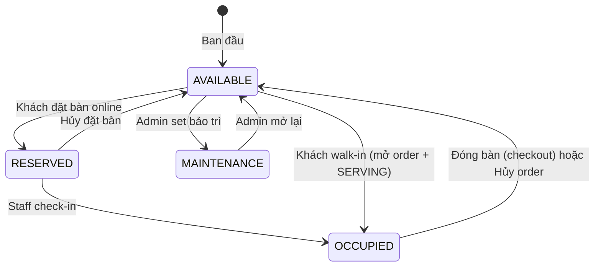

> [!NOTE]
> Staff **không trực tiếp** thay đổi trạng thái bàn. Bàn tự động thay đổi theo các hành động nghiệp vụ (đặt bàn, check-in, phục vụ, checkout, hủy).

---

## 4.5 🧾 MODULE INVOICE (Xem hóa đơn)

**Controller:** [StaffInvoiceController.java](file:///Volumes/study/laptrinhweb/web_dat_ban/src/main/java/vn/edu/ptit/restaurant/controller/staff/StaffInvoiceController.java)
**Base URL:** `/staff/invoices`

| API | Method | Mô tả |
|---|---|---|
| `/staff/invoices` | GET | Danh sách hóa đơn đã thanh toán (PAID) |
| `/staff/invoices?startDate=...&endDate=...` | GET | Lọc theo khoảng thời gian |
| `/staff/invoices/{id}` | GET | Chi tiết 1 hóa đơn |

**Tính năng:**
- Hiển thị tất cả Payment có status = `PAID`
- Lọc theo khoảng ngày (startDate, endDate)
- Tính **tổng doanh thu** của các hóa đơn lọc được
- Xem chi tiết: thông tin payment + danh sách OrderItem

---

## 4.6 👤 MODULE PROFILE (Thông tin cá nhân)

**Controller:** [StaffProfileController.java](file:///Volumes/study/laptrinhweb/web_dat_ban/src/main/java/vn/edu/ptit/restaurant/controller/staff/StaffProfileController.java)
**Base URL:** `/staff/profile`

| API | Method | Mô tả |
|---|---|---|
| `/staff/profile` | GET | Xem thông tin cá nhân |
| `/staff/profile/update` | POST | Cập nhật fullName, phone, email |
| `/staff/profile/change-password` | POST | Đổi mật khẩu |

**Đổi mật khẩu - Validation:**
1. `newPassword` phải trùng `confirmPassword`
2. `newPassword` phải ≥ 6 ký tự
3. `oldPassword` phải đúng (kiểm tra bằng BCrypt)

---

## 5. LUỒNG NGHIỆP VỤ TỔNG HỢP

### 5.1 ⭐ Luồng 1: Khách đặt bàn online → Đến nhà hàng → Phục vụ → Thanh toán → Ra về

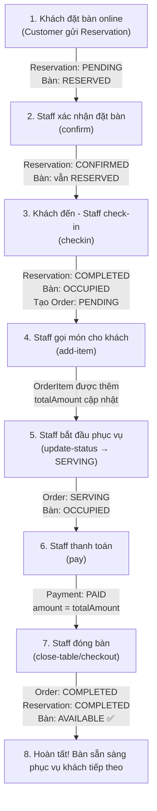

### 5.2 Luồng 2: Khách walk-in (đến trực tiếp không đặt trước)

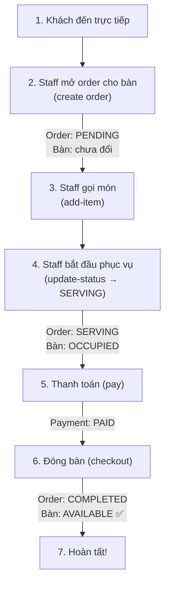

### 5.3 Luồng 3: Hủy đơn hàng

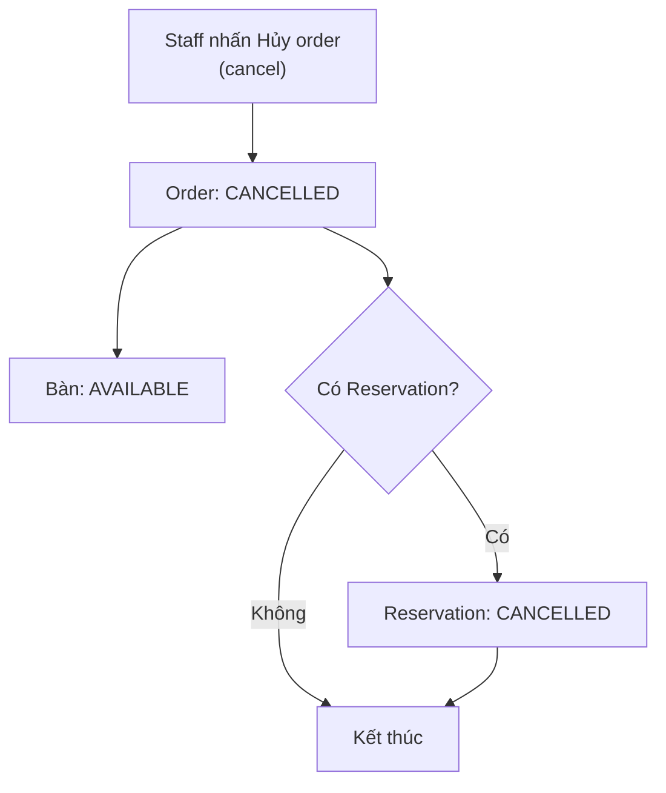

---

## 6. ANNOTATION & DESIGN PATTERN QUAN TRỌNG

### 6.1 Annotation thường gặp

| Annotation | Ở đâu | Ý nghĩa |
|---|---|---|
| `@Controller` | Controller class | Đánh dấu class là Controller (trả về View) |
| `@RequestMapping("/staff/orders")` | Controller class | Base URL cho tất cả method trong class |
| `@GetMapping` | Method | Xử lý HTTP GET request |
| `@PostMapping("/create")` | Method | Xử lý HTTP POST request |
| `@PathVariable` | Parameter | Lấy giá trị từ URL: `/orders/{id}` → `id` |
| `@RequestParam` | Parameter | Lấy giá trị từ form/query string |
| `@RequiredArgsConstructor` | Class | Lombok tự tạo constructor cho các field `final` |
| `@Service` | Service class | Đánh dấu class là Service, Spring quản lý |
| `@Transactional` | Method | Bọc method trong 1 database transaction |
| `@Entity` | Entity class | Ánh xạ class thành 1 bảng trong DB |
| `@Table(name="orders")` | Entity class | Chỉ định tên bảng |
| `@Id` + `@GeneratedValue` | Field | Primary Key, tự tăng |
| `@ManyToOne` | Field | Quan hệ Nhiều-1 (VD: nhiều Order → 1 Table) |
| `@OneToOne` | Field | Quan hệ 1-1 (VD: 1 Order → 1 Payment) |
| `@Enumerated(EnumType.STRING)` | Field | Lưu Enum dạng String trong DB |
| `@PrePersist` | Method | Chạy trước khi INSERT (auto set createdAt) |
| `@PreUpdate` | Method | Chạy trước khi UPDATE (auto set updatedAt) |
| `@Builder` | Class | Lombok tạo Builder pattern |
| `@Data` | Class | Lombok tạo getter/setter/toString/equals/hashCode |

### 6.2 Design Pattern sử dụng

| Pattern | Ở đâu | Giải thích |
|---|---|---|
| **MVC** | Toàn bộ | Model-View-Controller: tách biệt logic, data, giao diện |
| **Repository Pattern** | Repository layer | Trừu tượng hóa truy cập DB qua interface |
| **Service Layer Pattern** | Service layer | Tách biệt business logic khỏi Controller |
| **Builder Pattern** | Entity (Lombok @Builder) | Tạo object phức tạp: `Order.builder().table(t).build()` |
| **Dependency Injection** | Khắp nơi | Spring tự inject dependency qua constructor |
| **Interface Segregation** | Service | Interface riêng cho mỗi Service, impl riêng |
| **Template Method** | `@PrePersist/@PreUpdate` | JPA lifecycle callbacks |

### 6.3 `@Transactional` giải thích sâu

```java
@Transactional
public void checkout(Long orderId) {
    // Nếu BẤT KỲ dòng nào trong method này throw Exception,
    // TẤT CẢ thay đổi DB sẽ bị ROLLBACK (hoàn tác)
    order.setStatus(COMPLETED);      // ← thay đổi 1
    table.setStatus(AVAILABLE);      // ← thay đổi 2
    reservation.setStatus(COMPLETED); // ← thay đổi 3
    // Nếu dòng 3 lỗi → dòng 1, 2 cũng bị hoàn tác
    // → Đảm bảo TÍNH NHẤT QUÁN dữ liệu
}
```

---

## 7. SPRING DATA JPA - CÁCH QUERY

Repository kế thừa `JpaRepository<Entity, IdType>` → tự động có sẵn: `findAll()`, `findById()`, `save()`, `delete()`,...

**Query Method (tự sinh SQL từ tên hàm):**

| Method name | SQL tương đương |
|---|---|
| `findByStatus(OrderStatus status)` | `SELECT * FROM orders WHERE status = ?` |
| `findByOrderId(Long orderId)` | `SELECT * FROM payments WHERE order_id = ?` |
| `findByReservationId(Long id)` | `SELECT * FROM orders WHERE reservation_id = ?` |
| `findByUserIdOrderByReservationTimeDesc(Long userId)` | `SELECT * FROM reservations WHERE user_id = ? ORDER BY reservation_time DESC` |
| `findByStatusOrderByCreatedAtDesc(PaymentStatus s)` | `SELECT * FROM payments WHERE status = ? ORDER BY created_at DESC` |
| `findByReservationTimeBetweenAndStatusIn(...)` | `SELECT * FROM reservations WHERE reservation_time BETWEEN ? AND ? AND status IN (?, ?)` |
| `findByStatusAndCreatedAtBetween(...)` | `SELECT * FROM orders WHERE status = ? AND created_at BETWEEN ? AND ?` |

> [!TIP]
> Spring Data JPA phân tích tên method theo quy tắc: `findBy` + `FieldName` + `Keyword` (Between, In, OrderBy, Containing, ...) để tự động sinh câu query SQL. **Không cần viết SQL thủ công!**

---

## 8. `RedirectAttributes` & Flash Message

**Cách hoạt động:**

```java
redirectAttrs.addFlashAttribute("success", "Thanh toán thành công!");
return "redirect:/staff/orders/" + id;
```

- `addFlashAttribute`: dữ liệu chỉ tồn tại **1 lần** sau redirect (không còn khi F5)
- Thymeleaf hiển thị: `th:if="${success}"` → hiện thông báo xanh
- `th:if="${error}"` → hiện thông báo đỏ

---

## 9. CÂU HỎI VẤN ĐÁP THƯỜNG GẶP & GỢI Ý TRẢ LỜI

### 📌 Câu hỏi Kiến trúc

**Q1: Dự án sử dụng kiến trúc gì? Giải thích.**
> Dự án sử dụng kiến trúc **MVC phân tầng** (Layered MVC). Gồm 4 tầng: Controller nhận HTTP request và trả View, Service xử lý logic nghiệp vụ, Repository truy vấn database qua JPA, và Entity ánh xạ bảng DB thành Java object. Thêm tầng Security xử lý xác thực/phân quyền bằng Spring Security.

**Q2: Tại sao tách Service thành Interface và Impl?**
> Tuân thủ nguyên lý **Dependency Inversion** (SOLID). Controller phụ thuộc vào Interface, không phụ thuộc vào Implementation cụ thể. Lợi ích: dễ thay đổi logic (chỉ sửa Impl), dễ viết Unit Test (mock Interface), và tuân thủ **Open/Closed Principle** (mở rộng mà không sửa code cũ).

**Q3: `@RequiredArgsConstructor` hoạt động như nào? Tại sao không dùng `@Autowired`?**
> `@RequiredArgsConstructor` (Lombok) tự tạo constructor cho tất cả field `final`. Spring sẽ inject dependency qua constructor này (Constructor Injection). So với `@Autowired` (Field Injection), Constructor Injection được recommend vì: field là `final` (immutable), dễ viết test (truyền mock qua constructor), và buộc phải cung cấp tất cả dependency khi tạo object.

---

### 📌 Câu hỏi Nghiệp vụ

**Q4: Khi khách đặt bàn online, luồng phía Staff diễn ra như nào?**
> 1. Khách submit đặt bàn → Reservation được tạo (PENDING), bàn chuyển RESERVED
> 2. Staff vào trang Đặt bàn, thấy danh sách PENDING → nhấn **Xác nhận** → CONFIRMED
> 3. Khách đến nhà hàng → Staff nhấn **Check-in** → Reservation → COMPLETED, bàn → OCCUPIED, tự động tạo Order mới (PENDING)
> 4. Từ đây Staff chuyển sang module Order để gọi món, phục vụ, thanh toán, đóng bàn.

**Q5: Khách walk-in (không đặt trước) thì xử lý thế nào?**
> Staff vào trang Order, chọn bàn trống, nhấn **Tạo order**. Order được tạo với status PENDING, không có Reservation liên kết (reservation = null). Tiếp tục gọi món, phục vụ, thanh toán, đóng bàn như bình thường.

**Q6: Tại sao có trường `priceAtTime` trong OrderItem mà không lấy giá trực tiếp từ MenuItem?**
> Đây là **best practice** trong hệ thống thương mại. `priceAtTime` lưu giá món tại thời điểm gọi. Nếu Admin thay đổi giá sau đó, các hóa đơn cũ vẫn giữ đúng giá đã ghi nhận. Nếu lấy trực tiếp từ MenuItem, khi đổi giá sẽ làm sai tất cả hóa đơn lịch sử.

**Q7: Khi check-in, nếu khách đã đặt món trước thì sao?**
> Khi khách đặt bàn online, họ có thể thêm món vào giỏ hàng. Hệ thống tự động tạo Order + OrderItem ngay khi đặt bàn (trong `createReservation`). Khi Staff check-in, hệ thống kiểm tra: nếu đã có Order cho Reservation này → giữ nguyên Order đã có. Nếu chưa → tạo Order mới.

---

### 📌 Câu hỏi Database & JPA

**Q8: `spring.jpa.hibernate.ddl-auto=update` nghĩa là gì?**
> Hibernate sẽ tự động tạo/cập nhật cấu trúc bảng trong DB dựa trên Entity class. Khi thêm field mới → tự thêm cột. Khi thêm Entity mới → tự tạo bảng. **Chỉ dùng cho development**, production nên dùng `validate` hoặc migration tool (Flyway/Liquibase).

**Q9: `@PrePersist` và `@PreUpdate` dùng để làm gì?**
> Đây là JPA Lifecycle Callbacks. `@PrePersist` chạy tự động trước khi INSERT (thường dùng để set `createdAt`, `updatedAt`). `@PreUpdate` chạy trước khi UPDATE (cập nhật `updatedAt`). Developer không cần gọi thủ công.

**Q10: Giải thích quan hệ giữa Order và Reservation?**
> Order có quan hệ `@OneToOne` với Reservation qua `reservation_id`. Một Reservation có thể tạo ra 1 Order (khi check-in). Trường này **nullable** (`@JoinColumn(name="reservation_id")` không có `nullable=false`), vì khách walk-in sẽ có Order nhưng không có Reservation.

**Q11: `FetchType.LAZY` nghĩa là gì?**
> LAZY loading: chỉ load dữ liệu liên quan khi thực sự truy cập. VD: `order.getTable()` mới thực sự query bảng `tables`. Ngược lại, `FetchType.EAGER` load luôn khi query Order → tốn bộ nhớ nếu không cần. LAZY là **best practice** mặc định cho `@ManyToOne` và `@OneToOne`.

---

### 📌 Câu hỏi Bảo mật

**Q12: Spring Security phân quyền như nào?**
> Cấu hình trong `SecurityConfig.filterChain()`. URL pattern `/staff/**` yêu cầu `hasAnyRole("ADMIN", "STAFF")`. Spring Security kiểm tra `GrantedAuthority` của user đăng nhập. User role `STAFF` sẽ có authority `ROLE_STAFF` → match `hasAnyRole("STAFF")`. Customer có `ROLE_CUSTOMER` → bị chặn khi vào `/staff/**`.

**Q13: Tại sao dùng BCrypt?**
> BCrypt là thuật toán hash **một chiều** (không giải mã ngược). Có tính chất **salt** tự động (mỗi lần hash cùng 1 password cho kết quả khác nhau) → chống rainbow table attack. Có **cost factor** (tốn thời gian tính toán) → chống brute force. Đây là chuẩn industry cho lưu trữ password.

**Q14: `Principal` trong Controller là gì?**
> `Principal` đại diện cho user đang đăng nhập. `principal.getName()` trả về username. Spring Security tự động inject `Principal` vào method parameter khi user đã authenticated. Dùng để biết ai đang thao tác (VD: lưu `user_id` khi tạo Order).

---

### 📌 Câu hỏi `@Transactional`

**Q15: `@Transactional` hoạt động ra sao? Cho ví dụ.**
> `@Transactional` bọc method trong 1 database transaction. Nếu method hoàn thành → COMMIT tất cả thay đổi. Nếu throw RuntimeException → ROLLBACK tất cả. VD: method `checkout()` cập nhật 3 bảng (orders, tables, reservations). Nếu cập nhật bảng thứ 3 lỗi → 2 bảng trước cũng hoàn tác → đảm bảo tính nhất quán dữ liệu (ACID).

**Q16: Nếu không có `@Transactional` thì sao?**
> Mỗi lệnh `save()` sẽ commit riêng. Nếu save order thành công nhưng save table lỗi → dữ liệu không nhất quán (order đã COMPLETED nhưng bàn vẫn OCCUPIED). Transaction đảm bảo "all or nothing" - hoặc tất cả thành công, hoặc tất cả rollback.

---

### 📌 Câu hỏi Thymeleaf & Frontend

**Q17: Thymeleaf là gì? Tại sao dùng Thymeleaf?**
> Thymeleaf là **Server-Side Template Engine** cho Java. HTML được render trên server, trả về HTML hoàn chỉnh cho browser. Ưu điểm: tích hợp sâu với Spring (bind data, form, security), file HTML vẫn mở được trực tiếp trên browser (natural template), không cần build frontend riêng.

**Q18: Flash attribute hiển thị thế nào trên Thymeleaf?**
> Controller đặt: `redirectAttrs.addFlashAttribute("success", "Thành công!")`. Template kiểm tra: `th:if="${success}"` → hiện div thông báo. Flash attribute chỉ tồn tại 1 request sau redirect → tự biến mất khi F5.

---

### 📌 Câu hỏi Nâng cao

**Q19: Nếu 2 Staff cùng lúc mở order cho 1 bàn thì sao?**
> Hiện tại hệ thống chưa có lock pessimistic, nhưng Entity `DiningTable` có thể thêm `@Version` cho Optimistic Locking. Khi 2 transaction cùng cố update 1 bàn, JPA sẽ throw `ObjectOptimisticLockingFailureException` cho transaction thứ 2 → tránh conflict.

**Q20: Tại sao dùng `BigDecimal` cho tiền mà không dùng `Double`?**
> `Double` (floating point) có sai số khi tính toán tiền. VD: `0.1 + 0.2 = 0.30000000000000004`. `BigDecimal` lưu chính xác từng chữ số → không bao giờ sai số. Đây là **bắt buộc** khi làm việc với tiền trong mọi hệ thống.

**Q21: Soft delete là gì? Dùng ở đâu?**
> Thay vì xóa thật (DELETE FROM), set `deleted = true`. User entity có `@Builder.Default private Boolean deleted = false`. Method `deleteById()` trong `UserServiceImpl`: `user.setDeleted(true)` rồi save. Lợi ích: giữ lại lịch sử, có thể khôi phục, đảm bảo toàn vẹn quan hệ FK.

**Q22: Tại sao `Order.reservation` là `@OneToOne` mà không phải `@ManyToOne`?**
> Mỗi Reservation chỉ tạo ra đúng 1 Order (khi check-in). Và mỗi Order chỉ thuộc về tối đa 1 Reservation. Đây là quan hệ 1-1 đúng nghĩa. Nếu dùng `@ManyToOne` sẽ ngầm cho phép 1 Reservation có nhiều Order → sai logic.

---

## 10. TÓM TẮT CÁC URL API CỦA STAFF

| # | URL | Method | Chức năng |
|---|---|---|---|
| 1 | `/staff/dashboard` | GET | Trang tổng quan |
| 2 | `/staff/orders` | GET | Danh sách order |
| 3 | `/staff/orders/create` | POST | Tạo order mới |
| 4 | `/staff/orders/{id}` | GET | Chi tiết order |
| 5 | `/staff/orders/{id}/add-item` | POST | Thêm món |
| 6 | `/staff/orders/{id}/delete-item/{itemId}` | GET | Xóa món |
| 7 | `/staff/orders/{id}/update-status` | POST | Cập nhật trạng thái |
| 8 | `/staff/orders/{id}/pay` | POST | Thanh toán |
| 9 | `/staff/orders/{id}/close-table` | POST | Đóng bàn |
| 10 | `/staff/orders/{id}/cancel` | POST | Hủy order |
| 11 | `/staff/reservations` | GET | Danh sách đặt bàn |
| 12 | `/staff/reservations/{id}/confirm` | POST | Xác nhận đặt bàn |
| 13 | `/staff/reservations/{id}/cancel` | POST | Hủy đặt bàn |
| 14 | `/staff/reservations/{id}/checkin` | POST | Check-in khách |
| 15 | `/staff/tables` | GET | Xem trạng thái bàn |
| 16 | `/staff/invoices` | GET | Danh sách hóa đơn |
| 17 | `/staff/invoices/{id}` | GET | Chi tiết hóa đơn |
| 18 | `/staff/profile` | GET | Xem profile |
| 19 | `/staff/profile/update` | POST | Cập nhật profile |
| 20 | `/staff/profile/change-password` | POST | Đổi mật khẩu |

---

> [!TIP]
> **Mẹo thi vấn đáp:** Khi trả lời, hãy bắt đầu bằng **khái niệm ngắn gọn**, sau đó **cho ví dụ cụ thể trong code** của dự án. VD: "Dự án em dùng `@Transactional`, ví dụ trong method `checkout()` cập nhật 3 bảng orders, tables, reservations cùng lúc, nếu 1 bảng lỗi thì rollback hết để đảm bảo tính nhất quán."
