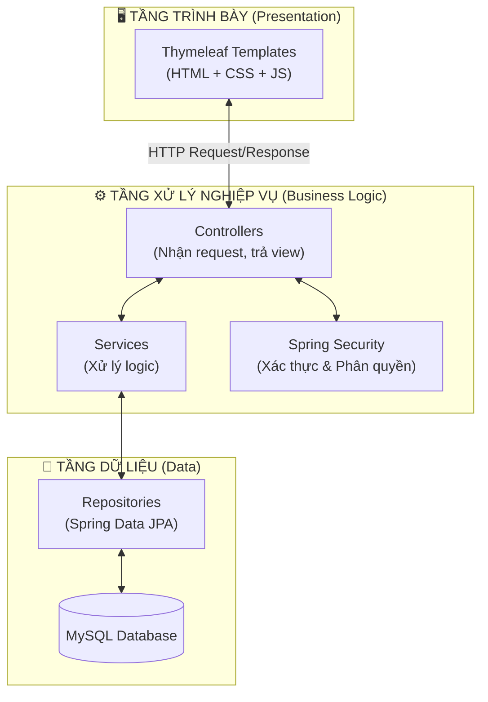
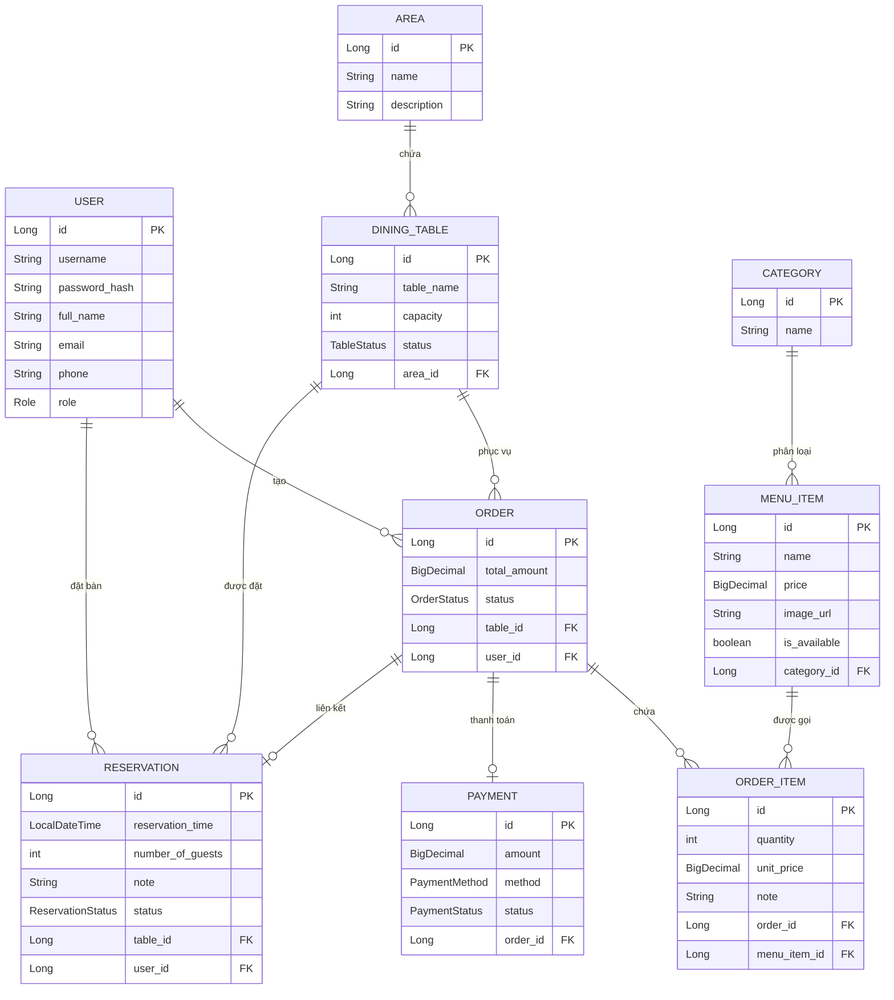

# 📐 TỔNG QUAN KIẾN TRÚC DỰ ÁN

## 1. Kiến trúc tổng thể (3‑Tier + MVC)

Dự án áp dụng kiến trúc **3 tầng** kết hợp mô hình **MVC** (Model – View – Controller) và **Server‑Side Rendering** (SSR) thông qua Thymeleaf.



**Giải thích đơn giản:**
- **Tầng Trình bày**: Là phần giao diện mà người dùng nhìn thấy. Thymeleaf nhận dữ liệu từ Controller và render ra HTML.
- **Tầng Xử lý**: Controller nhận yêu cầu từ trình duyệt → gọi Service để xử lý logic → Service gọi Repository lấy/cập nhật dữ liệu.
- **Tầng Dữ liệu**: Repository dùng Spring Data JPA để giao tiếp với cơ sở dữ liệu MySQL.

---

## 2. Cấu trúc thư mục dự án

```
src/main/java/vn/edu/ptit/restaurant/
├── controller/                    ← Nhận và xử lý yêu cầu HTTP
│   ├── admin/                     ← Controllers dành cho Admin
│   │   ├── AdminMenuController        (Quản lý thực đơn)
│   │   ├── AdminOrderController       (Quản lý đơn hàng)
│   │   ├── AdminPaymentController     (Quản lý thanh toán)
│   │   ├── AdminReportController      (Báo cáo doanh thu)
│   │   ├── AdminReservationController (Quản lý đặt bàn)
│   │   ├── AdminTableController       (Quản lý bàn ăn)
│   │   └── AdminUserController        (Quản lý người dùng)
│   ├── staff/                     ← Controllers dành cho Staff
│   │   ├── StaffDashboardController   (Tổng quan ca làm)
│   │   ├── StaffInvoiceController     (Lịch sử hóa đơn)
│   │   ├── StaffOrderController       (Gọi món, thanh toán)
│   │   ├── StaffProfileController     (Thông tin cá nhân)
│   │   ├── StaffReservationController (Xử lý đặt bàn)
│   │   └── StaffTableController       (Sơ đồ bàn)
│   ├── customer/                  ← Controllers dành cho Customer
│   │   ├── CustomerController         (Menu, giỏ hàng, đặt bàn)
│   │   └── HomeController             (Trang chủ)
│   └── auth/                      ← Xác thực (Đăng nhập/Đăng ký)
│       └── AuthController
├── entity/                        ← Các lớp Entity (ánh xạ bảng DB)
│   ├── enums/                     ← Các trạng thái (Role, OrderStatus...)
│   ├── User, Order, DiningTable, MenuItem, Category,
│   │   OrderItem, Payment, Reservation, Area
├── repository/                    ← Giao tiếp với DB (JPA Repository)
├── service/                       ← Logic nghiệp vụ
│   └── impl/                      ← Triển khai cụ thể
├── security/                      ← Spring Security
│   ├── SecurityConfig             ← Cấu hình phân quyền URL
│   ├── CustomUserDetailsService   ← Load user từ DB
│   └── CustomAuthenticationSuccessHandler ← Redirect theo role
└── dto/                           ← Data Transfer Objects
```

```
src/main/resources/templates/      ← Giao diện Thymeleaf
├── admin/                         ← Giao diện Admin
│   ├── dashboard/, menu/, order/, reservation/, table/, user/, report/
├── staff/                         ← Giao diện Staff
│   ├── dashboard/, order/, table/, reservation/, invoice/, profile/
├── customer/                      ← Giao diện Customer
│   ├── menu.html, cart.html, reservation.html, my-reservations.html
├── fragments/                     ← Các thành phần dùng chung (header, sidebar)
├── login.html, register.html, index.html  ← Trang công khai
```

---

## 3. Công nghệ sử dụng

| Công nghệ | Mục đích |
|-----------|---------|
| **Java 17** | Ngôn ngữ lập trình chính |
| **Spring Boot 3** | Framework web (auto‑config, embedded Tomcat) |
| **Spring Security 6** | Xác thực (login) & phân quyền (role) |
| **Spring Data JPA** | ORM – ánh xạ Entity ↔ Bảng DB |
| **Thymeleaf** | Template engine – render HTML phía server |
| **MySQL 8.0** | Hệ quản trị CSDL |
| **Lombok** | Tự sinh getter/setter, constructor |
| **Docker & Docker Compose** | Container hóa ứng dụng |
| **Apache POI** | Xuất báo cáo Excel (.xlsx) |
| **OpenPDF** | Xuất danh sách PDF |
| **BCrypt** | Mã hóa mật khẩu |

---

## 4. Entity – Mối quan hệ tổng thể



---

## 5. Danh sách Enum (Trạng thái)

| Enum | Giá trị | Ý nghĩa |
|------|---------|---------|
| **Role** | `CUSTOMER`, `STAFF`, `ADMIN` | Vai trò người dùng |
| **TableStatus** | `AVAILABLE`, `OCCUPIED`, `RESERVED`, `MAINTENANCE` | Trống / Đang dùng / Đã đặt / Bảo trì |
| **OrderStatus** | `PENDING`, `CONFIRMED`, `SERVING`, `COMPLETED`, `CANCELLED` | Chờ / Xác nhận / Đang phục vụ / Xong / Hủy |
| **PaymentStatus** | `PENDING`, `PAID`, `FAILED`, `REFUNDED` | Chờ / Đã thanh toán / Lỗi / Hoàn tiền |
| **PaymentMethod** | `CASH`, `CARD`, `E_WALLET`, `BANK_TRANSFER` | Tiền mặt / Thẻ / Ví / Chuyển khoản |
| **ReservationStatus** | `PENDING`, `CONFIRMED`, `CANCELLED`, `COMPLETED` | Chờ / Xác nhận / Hủy / Hoàn tất |
