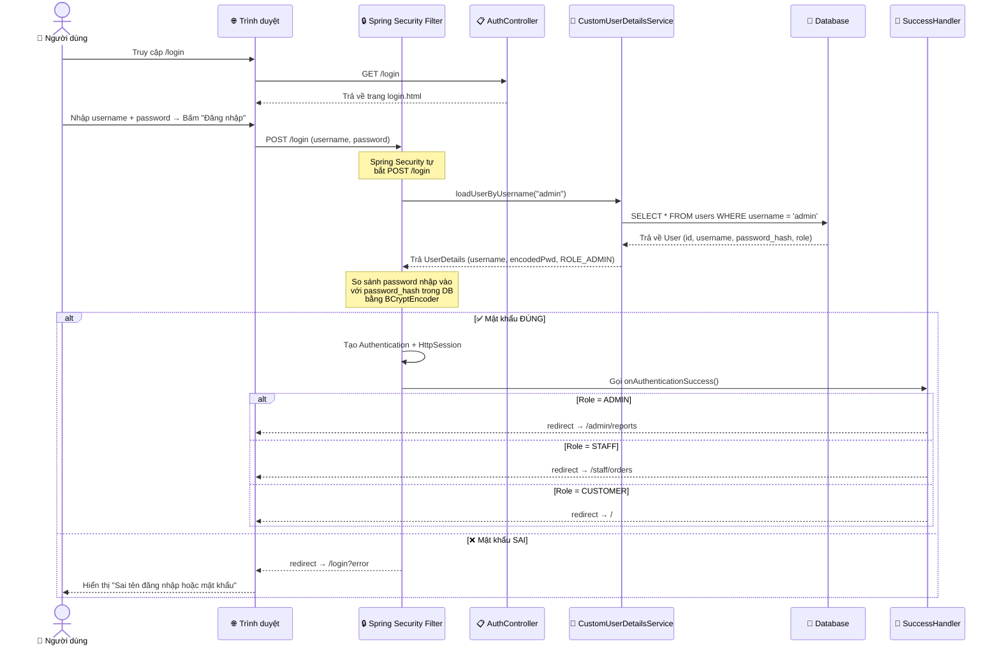
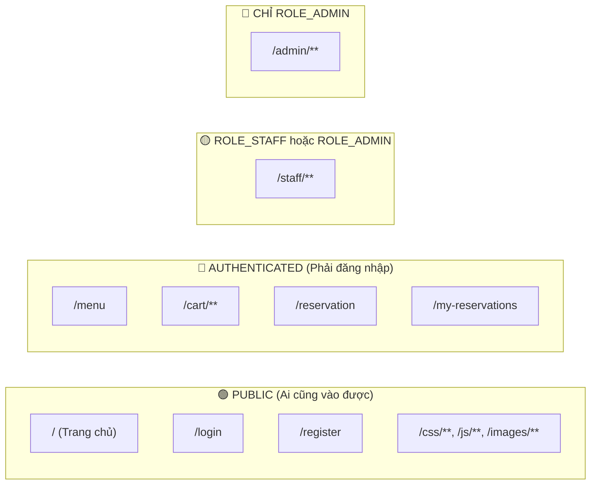
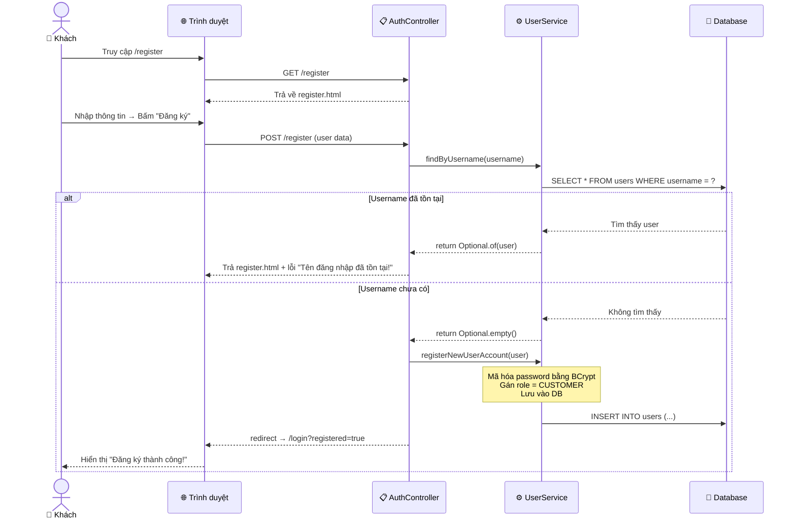
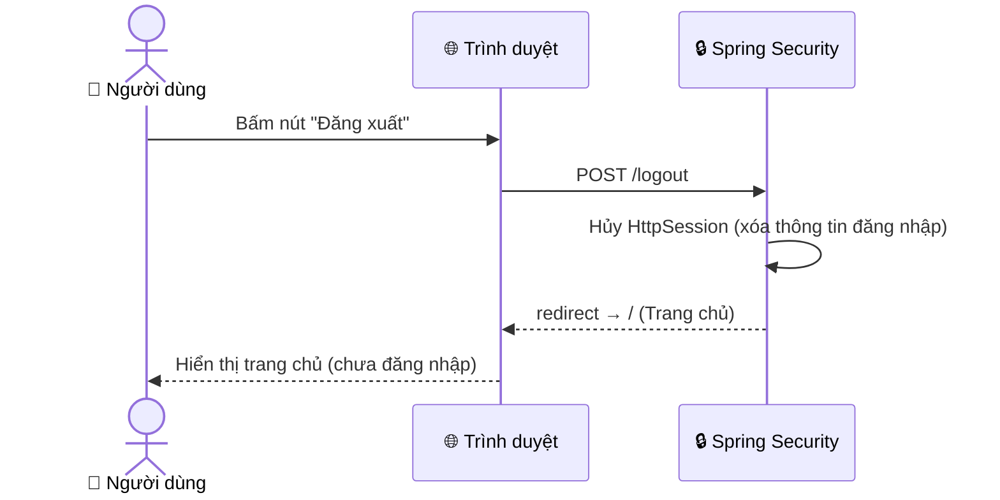
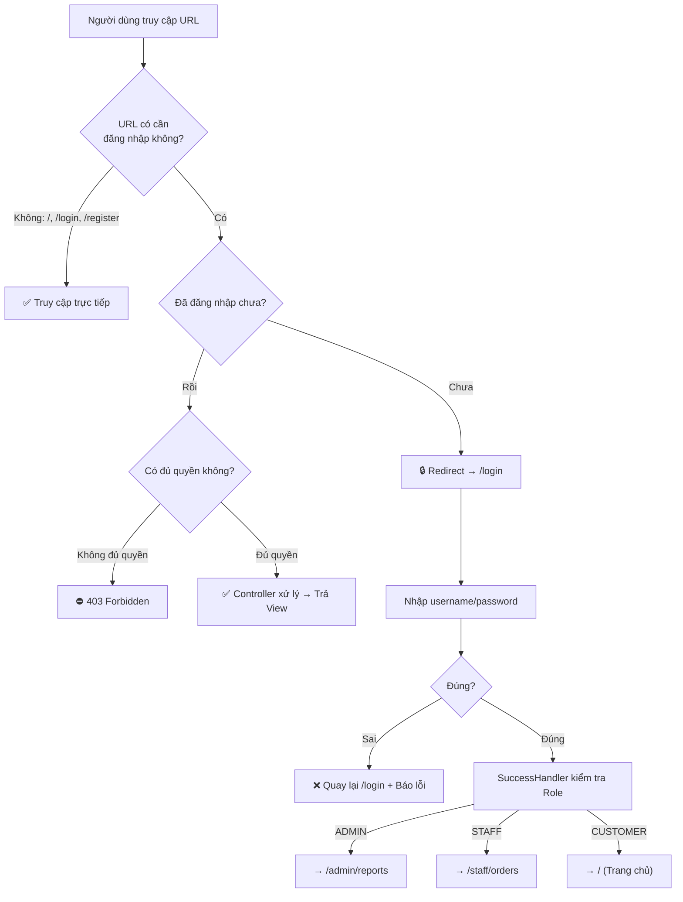

# 🔐 LUỒNG XÁC THỰC & PHÂN QUYỀN

## 1. Tổng quan Spring Security trong dự án

Spring Security bảo vệ toàn bộ ứng dụng thông qua 3 file chính:

| File | Chức năng |
|------|-----------|
| `SecurityConfig.java` | Cấu hình URL nào ai được truy cập, form đăng nhập, logout |
| `CustomUserDetailsService.java` | Tìm user trong DB khi đăng nhập |
| `CustomAuthenticationSuccessHandler.java` | Sau khi login thành công → chuyển hướng theo role |

---

## 2. Luồng đăng nhập chi tiết



### Giải thích từng bước:

| Bước | Mô tả | Code tương ứng |
|------|-------|----------------|
| 1 | Người dùng mở trang `/login` | `AuthController.showLoginForm()` → trả `login.html` |
| 2 | Nhập username + password rồi bấm "Đăng nhập" | Form submit POST `/login` |
| 3 | Spring Security tự động bắt request POST `/login` | Cấu hình trong `SecurityConfig.formLogin()` |
| 4 | Gọi `loadUserByUsername()` để tìm user trong DB | `CustomUserDetailsService` → `UserRepository.findByUsername()` |
| 5 | So sánh password đã mã hóa | `BCryptPasswordEncoder.matches(rawPwd, encodedPwd)` |
| 6 | Nếu đúng → tạo Session → gọi SuccessHandler | `CustomAuthenticationSuccessHandler.onAuthenticationSuccess()` |
| 7 | SuccessHandler kiểm tra role → redirect phù hợp | `ROLE_ADMIN` → `/admin/reports`, `ROLE_STAFF` → `/staff/orders` |

---

## 3. Cấu hình phân quyền URL



**Code thực tế trong `SecurityConfig.java`:**

```java
http.authorizeHttpRequests(authorize -> authorize
    // ✅ Công khai - ai cũng vào được
    .requestMatchers("/", "/login", "/register", "/css/**", "/js/**", "/images/**")
        .permitAll()

    // ✅ Phải đăng nhập mới vào được
    .requestMatchers("/menu", "/cart/**", "/reservation", "/my-reservations")
        .authenticated()

    // ✅ Chỉ ADMIN mới vào
    .requestMatchers("/admin/**").hasRole("ADMIN")

    // ✅ ADMIN hoặc STAFF đều vào được
    .requestMatchers("/staff/**").hasAnyRole("ADMIN", "STAFF")

    // ✅ Mọi URL còn lại → phải đăng nhập
    .anyRequest().authenticated()
);
```

---

## 4. Luồng đăng ký tài khoản



---

## 5. Luồng Logout



---

## 6. Tóm tắt luồng xác thực


