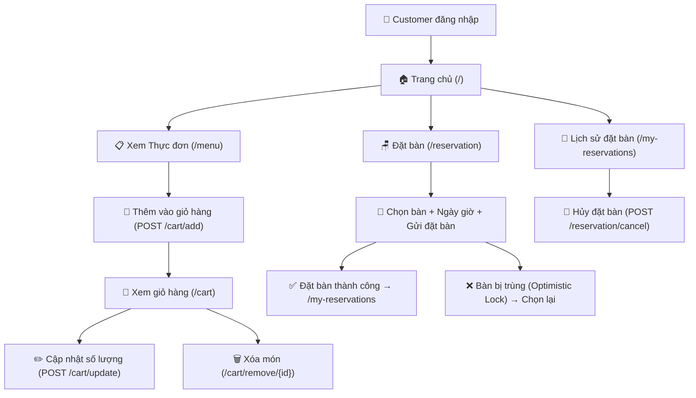
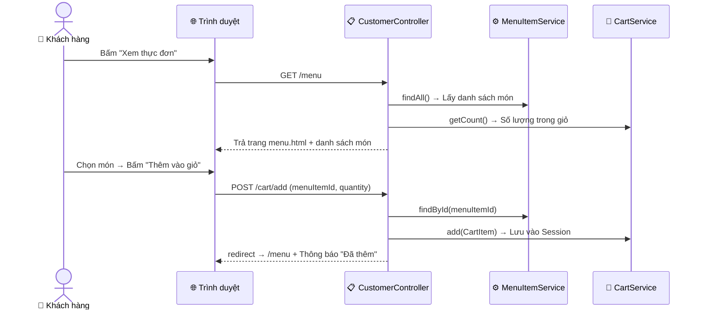
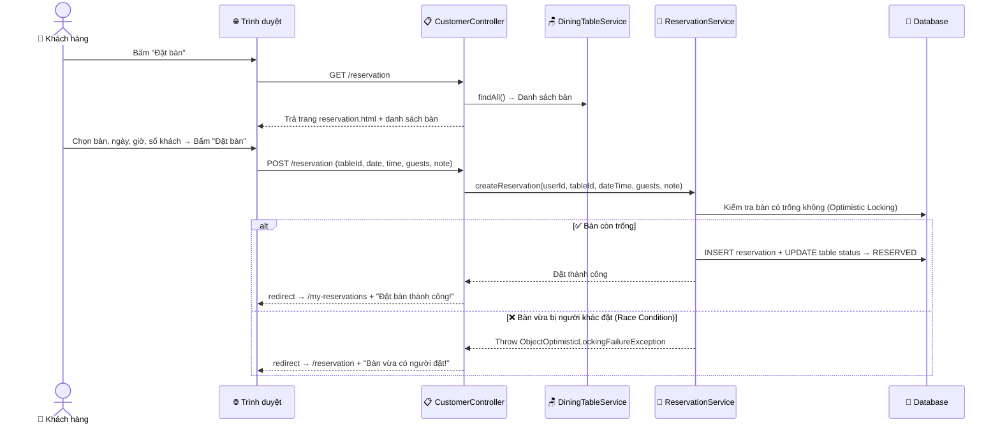
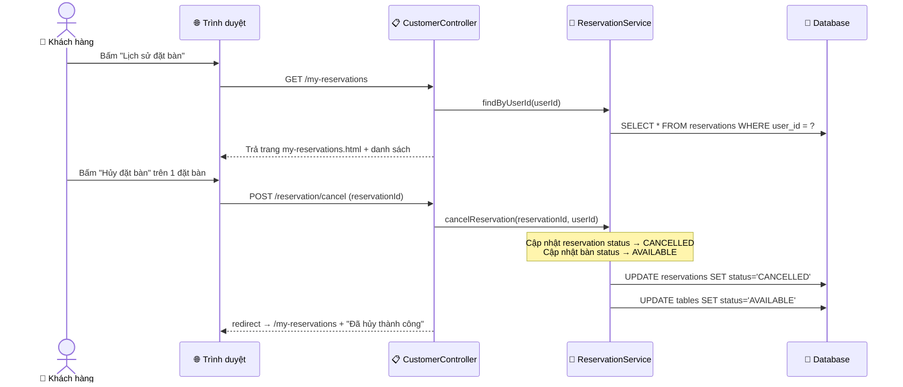

# 🍽️ LUỒNG NGHIỆP VỤ CUSTOMER (Khách hàng)

## Tổng quan chức năng

Khách hàng sau khi đăng nhập có thể:
1. **Xem thực đơn** → Thêm món vào giỏ hàng
2. **Quản lý giỏ hàng** → Xem, cập nhật, xóa món
3. **Đặt bàn** → Chọn bàn, ngày giờ, số khách
4. **Xem lịch sử đặt bàn** → Hủy đặt bàn nếu cần

---

## 1. Sơ đồ tổng thể chức năng Customer



---

## 2. Luồng xem thực đơn & thêm giỏ hàng



### Code thực tế:

```java
// CustomerController.java
@PostMapping("/cart/add")
public String addToCart(@RequestParam Long menuItemId,
                        @RequestParam(defaultValue = "1") Integer quantity,
                        RedirectAttributes redirectAttrs) {
    MenuItem item = menuItemService.findById(menuItemId).orElseThrow();
    CartItem cartItem = CartItem.builder()
            .menuItemId(item.getId())
            .name(item.getName())
            .price(item.getPrice())
            .imageUrl(item.getImageUrl())
            .quantity(quantity)
            .build();
    cartService.add(cartItem);
    redirectAttrs.addFlashAttribute("success", "Đã thêm " + item.getName() + " vào giỏ hàng");
    return "redirect:/menu";
}
```

> 💡 **Giỏ hàng được lưu trong Session** (không lưu DB). Khi đóng trình duyệt → giỏ hàng mất.

---

## 3. Luồng đặt bàn chi tiết



### Optimistic Locking là gì?

Khi 2 khách hàng cùng lúc đặt chung 1 bàn:
- Spring Data JPA dùng trường `@Version` trong entity `DiningTable`
- Người đặt **trước** thành công → bàn chuyển trạng thái `RESERVED`
- Người đặt **sau** → JPA phát hiện version đã thay đổi → throw exception → hiện thông báo lỗi

---

## 4. Luồng xem & hủy đặt bàn



---

## 5. Bảng tóm tắt các endpoint Customer

| HTTP Method | URL | Controller Method | Mô tả |
|------------|-----|------------------|--------|
| GET | `/menu` | `viewMenu()` | Xem thực đơn |
| POST | `/cart/add` | `addToCart()` | Thêm món vào giỏ |
| GET | `/cart` | `viewCart()` | Xem giỏ hàng |
| POST | `/cart/update` | `updateCart()` | Cập nhật số lượng |
| GET | `/cart/remove/{id}` | `removeFromCart()` | Xóa món khỏi giỏ |
| GET | `/reservation` | `viewReservationForm()` | Form đặt bàn |
| POST | `/reservation` | `submitReservation()` | Gửi đặt bàn |
| GET | `/my-reservations` | `myReservations()` | Lịch sử đặt bàn |
| POST | `/reservation/cancel` | `cancelReservation()` | Hủy đặt bàn |
