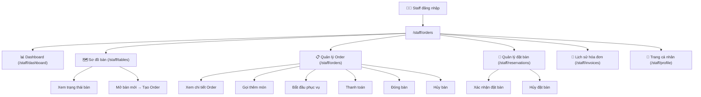
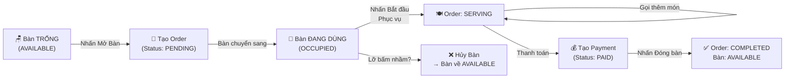
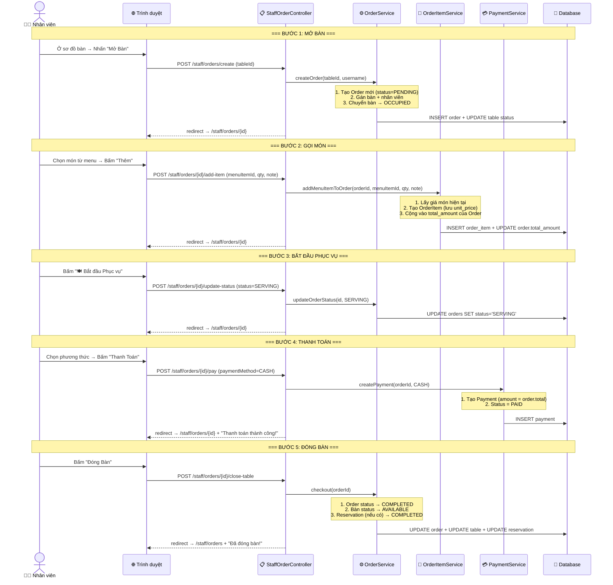
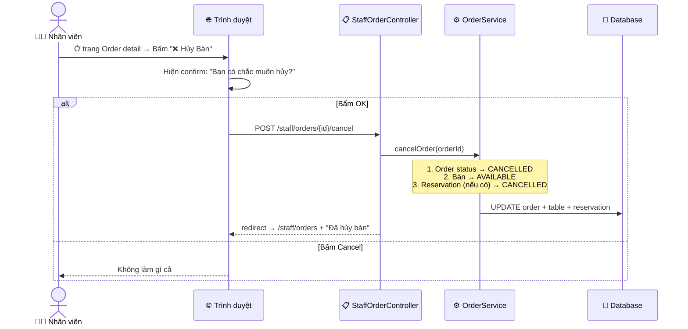
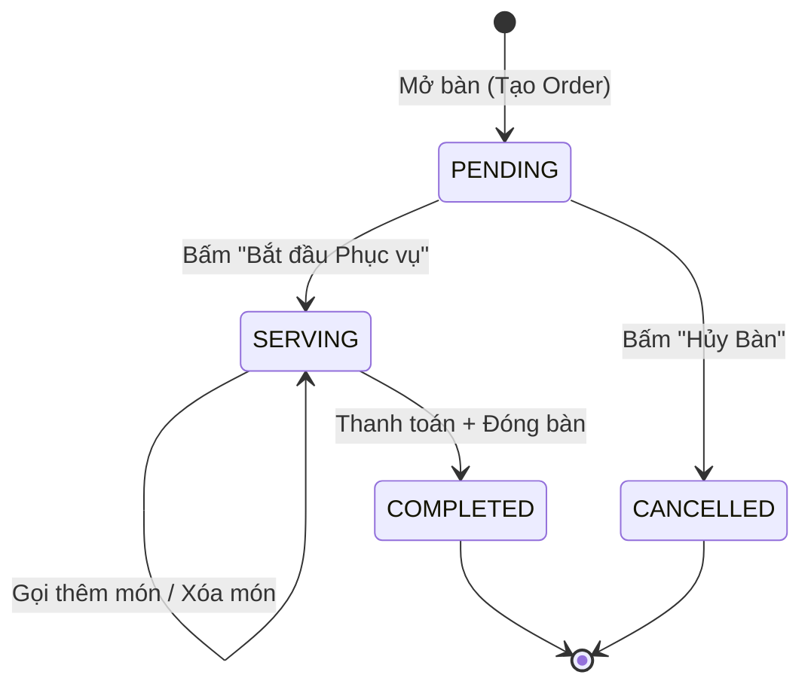
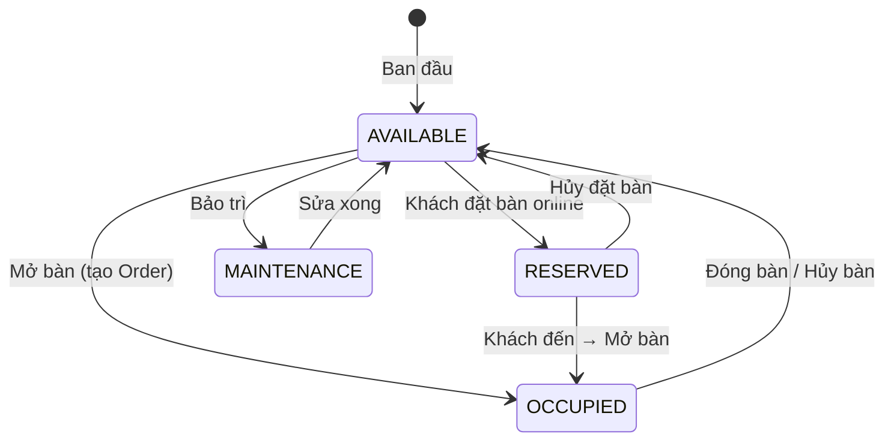
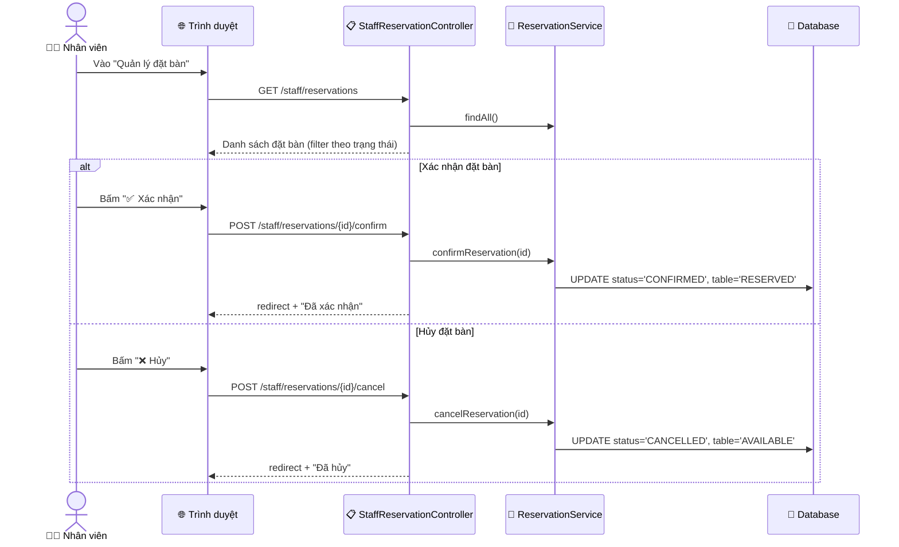
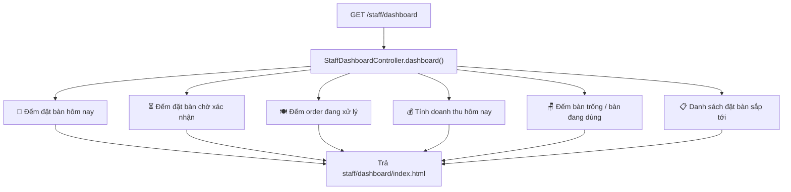

# 👨‍🍳 LUỒNG NGHIỆP VỤ STAFF (Nhân viên)

## Tổng quan chức năng

Nhân viên sau khi đăng nhập được chuyển tới `/staff/orders` và có thể:
1. **Dashboard** → Tổng quan ca làm (doanh thu, đơn đang xử lý)
2. **Sơ đồ bàn** → Xem trạng thái bàn, mở bàn
3. **Quản lý Order** → Mở bàn, gọi món, thanh toán, đóng bàn, hủy bàn
4. **Quản lý đặt bàn** → Xác nhận / Hủy đặt bàn của khách
5. **Lịch sử hóa đơn** → Xem các hóa đơn đã thanh toán
6. **Trang cá nhân** → Đổi thông tin cá nhân, đổi mật khẩu

---

## 1. Sơ đồ tổng thể chức năng Staff

---

## 2. Luồng chính: Mở bàn → Gọi món → Thanh toán → Đóng bàn

Đây là luồng nghiệp vụ **quan trọng nhất** của Staff:

### Sequence Diagram chi tiết:

---

## 3. Luồng Hủy bàn (khi bấm nhầm)

---

## 4. Sơ đồ trạng thái Order

## 5. Sơ đồ trạng thái Bàn

---

## 6. Luồng quản lý đặt bàn (Staff)

---

## 7. Dashboard Staff

---

## 8. Bảng tóm tắt các endpoint Staff

| HTTP | URL | Controller | Method | Mô tả |
|------|-----|-----------|--------|--------|
| GET | `/staff/dashboard` | StaffDashboardController | `dashboard()` | Tổng quan ca làm |
| GET | `/staff/tables` | StaffTableController | `index()` | Sơ đồ bàn |
| GET | `/staff/orders` | StaffOrderController | `index()` | DS order + sơ đồ bàn |
| POST | `/staff/orders/create` | StaffOrderController | `createOrder()` | Mở bàn mới |
| GET | `/staff/orders/{id}` | StaffOrderController | `orderDetail()` | Chi tiết Order |
| POST | `/staff/orders/{id}/add-item` | StaffOrderController | `addItem()` | Thêm món |
| GET | `/staff/orders/{id}/delete-item/{itemId}` | StaffOrderController | `deleteItem()` | Xóa món |
| POST | `/staff/orders/{id}/update-status` | StaffOrderController | `updateStatus()` | Đổi trạng thái |
| POST | `/staff/orders/{id}/pay` | StaffOrderController | `payOrder()` | Thanh toán |
| POST | `/staff/orders/{id}/close-table` | StaffOrderController | `closeTable()` | Đóng bàn |
| POST | `/staff/orders/{id}/cancel` | StaffOrderController | `cancelOrder()` | Hủy bàn |
| GET | `/staff/reservations` | StaffReservationController | `index()` | DS đặt bàn |
| POST | `/staff/reservations/{id}/confirm` | StaffReservationController | `confirm()` | Xác nhận |
| POST | `/staff/reservations/{id}/cancel` | StaffReservationController | `cancel()` | Hủy đặt bàn |
| GET | `/staff/invoices` | StaffInvoiceController | `index()` | Lịch sử hóa đơn |
| GET | `/staff/invoices/{id}` | StaffInvoiceController | `detail()` | Chi tiết hóa đơn |
| GET | `/staff/profile` | StaffProfileController | `index()` | Thông tin cá nhân |
| POST | `/staff/profile/update` | StaffProfileController | `update()` | Cập nhật thông tin |
| POST | `/staff/profile/change-password` | StaffProfileController | `changePassword()` | Đổi mật khẩu |
