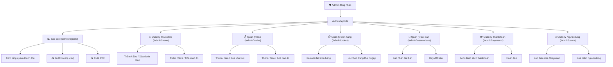
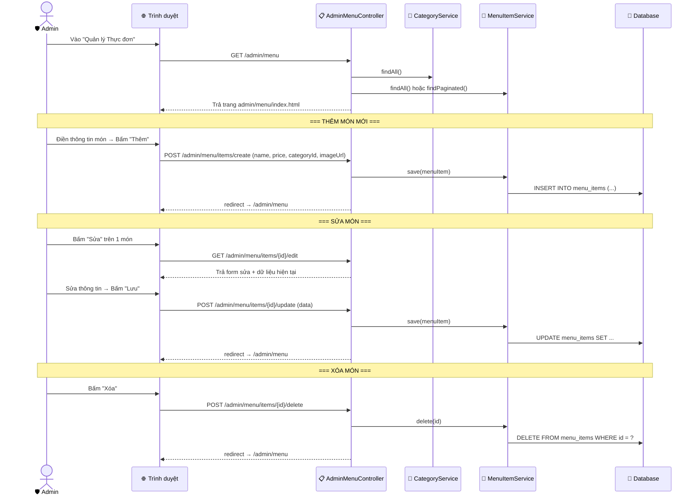
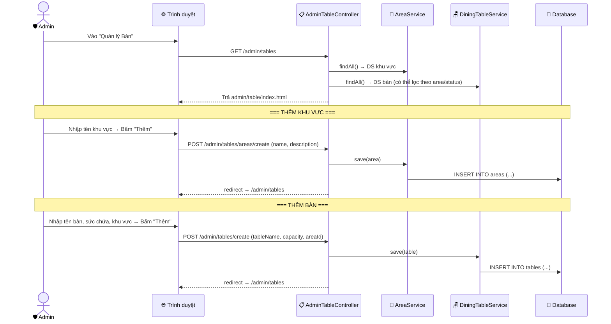
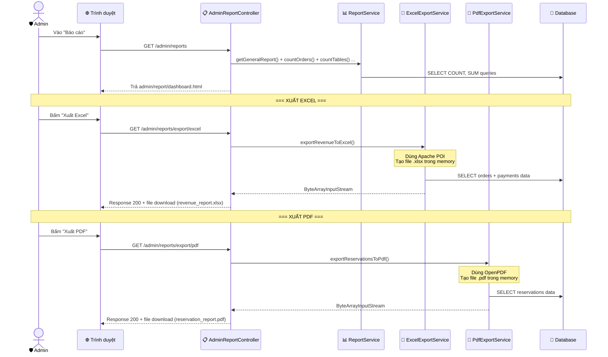
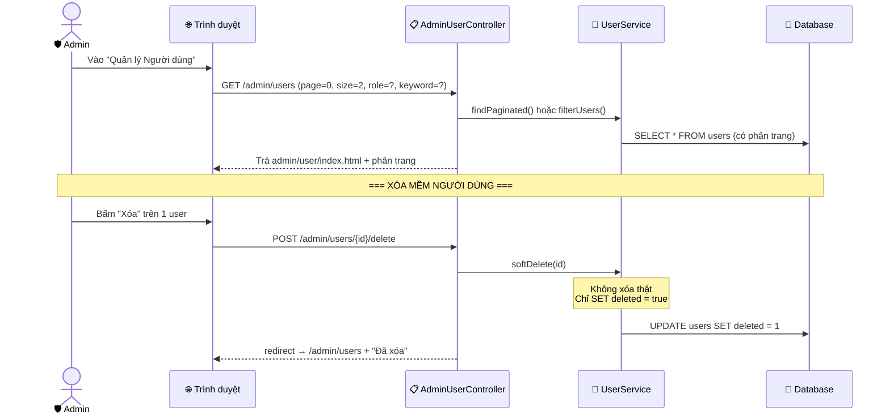

# 🛡️ LUỒNG NGHIỆP VỤ ADMIN (Quản trị viên)

## Tổng quan chức năng

Admin sau khi đăng nhập được chuyển tới `/admin/reports` và có quyền truy cập **toàn bộ** chức năng hệ thống:
1. **Báo cáo & Thống kê** → Doanh thu, số liệu, xuất Excel/PDF
2. **Quản lý thực đơn** → CRUD Danh mục + Món ăn
3. **Quản lý bàn & khu vực** → CRUD Bàn ăn + Khu vực
4. **Quản lý đơn hàng** → Xem, lọc, phân trang
5. **Quản lý đặt bàn** → Xem, lọc theo trạng thái, xác nhận / hủy
6. **Quản lý thanh toán** → Xem danh sách, xử lý hoàn tiền
7. **Quản lý người dùng** → Xem, lọc, phân trang, xóa mềm

> 💡 Admin cũng có thể truy cập toàn bộ trang `/staff/**` nhờ cấu hình `hasAnyRole("ADMIN", "STAFF")`.

---

## 1. Sơ đồ tổng thể chức năng Admin

---

## 2. Luồng Quản lý Thực đơn (Menu)

---

## 3. Luồng Quản lý Bàn & Khu vực

---

## 4. Luồng Báo cáo & Xuất file

---

## 5. Luồng Quản lý Người dùng

> 💡 **Xóa mềm (Soft Delete)**: Người dùng không bị xóa khỏi DB mà chỉ bị đánh dấu `deleted = true`. Dữ liệu liên quan (orders, reservations) vẫn được giữ nguyên.

---

## 6. Bảng tóm tắt các endpoint Admin

| HTTP | URL | Controller | Mô tả |
|------|-----|-----------|--------|
| GET | `/admin/reports` | AdminReportController | Dashboard báo cáo |
| GET | `/admin/reports/export/excel` | AdminReportController | Xuất file Excel |
| GET | `/admin/reports/export/pdf` | AdminReportController | Xuất file PDF |
| GET | `/admin/menu` | AdminMenuController | DS danh mục + món ăn |
| POST | `/admin/menu/categories/create` | AdminMenuController | Thêm danh mục |
| POST | `/admin/menu/categories/{id}/update` | AdminMenuController | Sửa danh mục |
| POST | `/admin/menu/categories/{id}/delete` | AdminMenuController | Xóa danh mục |
| POST | `/admin/menu/items/create` | AdminMenuController | Thêm món |
| POST | `/admin/menu/items/{id}/update` | AdminMenuController | Sửa món |
| POST | `/admin/menu/items/{id}/delete` | AdminMenuController | Xóa món |
| GET | `/admin/tables` | AdminTableController | DS khu vực + bàn |
| POST | `/admin/tables/areas/create` | AdminTableController | Thêm khu vực |
| POST | `/admin/tables/create` | AdminTableController | Thêm bàn |
| POST | `/admin/tables/{id}/update` | AdminTableController | Sửa bàn |
| POST | `/admin/tables/{id}/delete` | AdminTableController | Xóa bàn |
| GET | `/admin/orders` | AdminOrderController | DS đơn hàng (lọc, phân trang) |
| GET | `/admin/orders/{id}` | AdminOrderController | Chi tiết đơn hàng |
| GET | `/admin/reservations` | AdminReservationController | DS đặt bàn |
| POST | `/admin/reservations/{id}/confirm` | AdminReservationController | Xác nhận |
| POST | `/admin/reservations/{id}/cancel` | AdminReservationController | Hủy |
| GET | `/admin/payments` | AdminPaymentController | DS thanh toán |
| POST | `/admin/payments/{id}/refund` | AdminPaymentController | Hoàn tiền |
| GET | `/admin/users` | AdminUserController | DS người dùng |
| POST | `/admin/users/{id}/delete` | AdminUserController | Xóa mềm |
