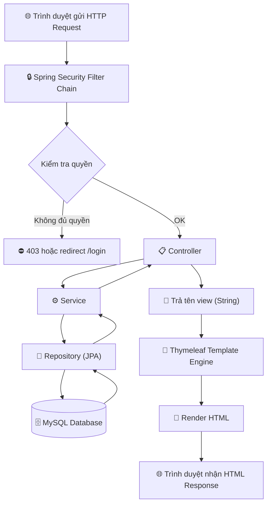
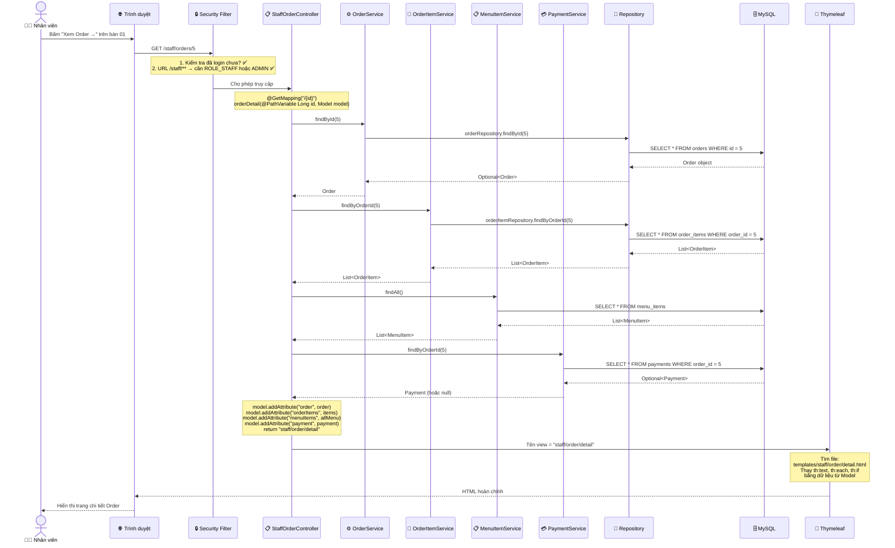
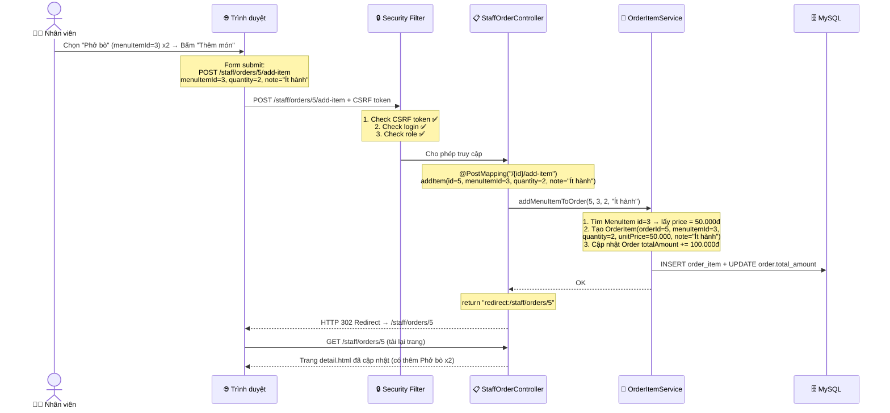

# 🔄 LUỒNG XỬ LÝ REQUEST TỔNG HỢP (MVC Pattern)

## 1. Request đi qua những lớp nào?

Khi người dùng bấm một nút hoặc truy cập một URL, request sẽ đi qua các tầng theo thứ tự sau:

---

## 2. Ví dụ cụ thể: Staff xem chi tiết Order

Giả sử nhân viên bấm vào **"Xem Order"** trên bàn 01:

---

## 3. Ví dụ cụ thể: POST request (Thêm món vào Order)

> 💡 **Mẫu PRG (Post-Redirect-Get)**: Sau mỗi POST, controller luôn trả về `redirect:` thay vì trả view trực tiếp. Điều này tránh việc user bấm F5 (refresh) gửi lại form.

---

## 4. Bảng tổng hợp: Component nào làm gì?

| Tầng | Component | Nhiệm vụ | Ví dụ |
|------|-----------|----------|-------|
| **Trình duyệt** | HTML Form | Gửi request đến server | `<form action="/staff/orders/5/add-item" method="post">` |
| **Security** | SecurityFilterChain | Kiểm tra login + role + CSRF | Chặn `/admin/**` nếu không phải ADMIN |
| **Controller** | `@Controller` | Nhận request, gọi service, trả view | `StaffOrderController.addItem()` |
| **Service** | `@Service` | Xử lý logic nghiệp vụ | Tính tổng tiền, kiểm tra trạng thái |
| **Repository** | `@Repository` (JPA) | Giao tiếp với DB | `orderRepository.findById(5)` |
| **Entity** | `@Entity` | Ánh xạ bảng trong DB | `Order`, `OrderItem`, `Payment` |
| **View** | Thymeleaf `.html` | Render HTML từ dữ liệu Model | `th:each="item : ${orderItems}"` |

---

## 5. Annotation thường dùng

| Annotation | Ý nghĩa | Ví dụ |
|-----------|---------|-------|
| `@Controller` | Đánh dấu class là Controller | `public class StaffOrderController` |
| `@RequestMapping("/staff/orders")` | Prefix cho tất cả URL trong controller | Mọi method trong class sẽ bắt đầu bằng `/staff/orders` |
| `@GetMapping("/{id}")` | Bắt request GET | Hiển thị chi tiết order |
| `@PostMapping("/{id}/add-item")` | Bắt request POST | Thêm món (thay đổi dữ liệu) |
| `@PathVariable` | Lấy giá trị từ URL | `/staff/orders/5` → `id = 5` |
| `@RequestParam` | Lấy giá trị từ form/query | `?status=PENDING` → `status = PENDING` |
| `@Service` | Đánh dấu class chứa logic nghiệp vụ | `OrderServiceImpl` |
| `@Repository` | Đánh dấu interface giao tiếp DB | `OrderRepository extends JpaRepository` |
| `@Entity` | Đánh dấu class ánh xạ bảng DB | `Order` → bảng `orders` |
| `@Transactional` | Đảm bảo toàn vẹn dữ liệu | Nếu 1 bước lỗi → rollback tất cả |
| `RedirectAttributes` | Truyền thông báo qua redirect | `addFlashAttribute("success", "Thành công!")` |

---

## 6. Thymeleaf cơ bản

| Cú pháp | Mô tả | Ví dụ |
|---------|-------|-------|
| `th:text` | Hiển thị text | `0đ` |
| `th:each` | Vòng lặp | `<tr th:each="item : ${orderItems}">` |
| `th:if` | Điều kiện hiển thị | `
` |
| `th:unless` | Ngược lại th:if | Hiển thị khi điều kiện sai |
| `th:action` | URL cho form | `th:action="@{'/staff/orders/' + ${order.id} + '/pay'}"` |
| `th:href` | URL cho link | `th:href="@{'/staff/orders/' + ${order.id}}"` |
| `th:replace` | Chèn fragment | `th:replace="~{fragments/staff-layout :: sidebar}"` |
| `@{...}` | Tạo URL tương đối | `@{/staff/orders}` → `/staff/orders` |
| `${...}` | Lấy biến từ Model | `${order.totalAmount}` |
