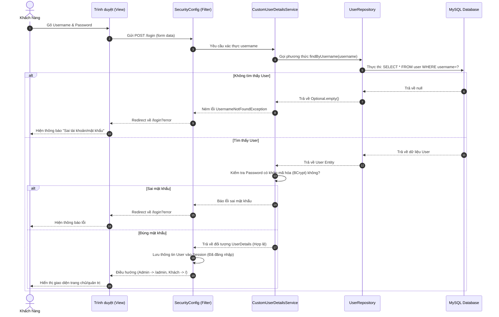
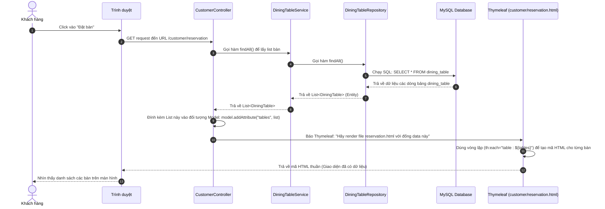

# Sơ đồ Luồng chạy thực tế (Execution Flows)

Để dễ hình dung cách các file "nói chuyện" với nhau, hãy cùng xem các sơ đồ luồng (Sequence Diagram) dưới đây. Mỗi mũi tên thể hiện một bước dữ liệu truyền qua lại giữa các thành phần.

## 1. Luồng chạy thực tế: Quá trình Đăng nhập (Login)

Quá trình này giải thích cách Spring Security và `UserRepository` hoạt động cùng nhau khi người dùng gõ Username/Password.

---

## 2. Luồng chạy thực tế: Khách hàng xem Danh sách Bàn ăn

Ví dụ này sẽ chỉ ra vai trò của `Controller`, `Service`, `Repository` và `View` khi bạn muốn hiển thị một danh sách lên màn hình.

---

## 3. Tóm tắt "Luật lệ" truyền dữ liệu

Để hệ thống không bị "rối", Spring Boot ép chúng ta tuân thủ quy tắc truyền dữ liệu theo đúng **1 chiều**:

1. **Browser** KHÔNG ĐƯỢC gọi thẳng xuống **Database**.
2. **Controller** KHÔNG ĐƯỢC gọi thẳng **Repository**. (Nó phải nhờ **Service** làm trung gian).
3. **Repository** chỉ làm một nhiệm vụ duy nhất: Giao tiếp với **Database**. Không được chứa logic tính toán (như tính thuế, giảm giá...). Logic tính toán phải nằm ở **Service**.

Quy trình chuẩn luôn luôn là:  
`Trình duyệt` ⇄ `Controller` ⇄ `Service` ⇄ `Repository` ⇄ `Database`
